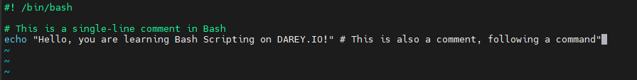
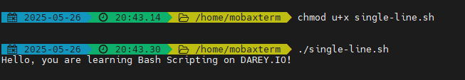
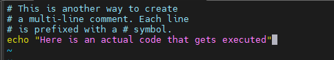
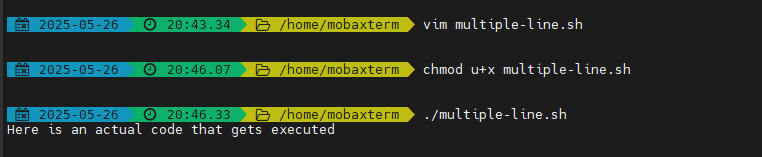
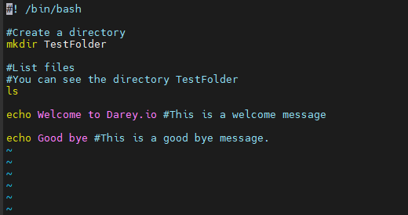
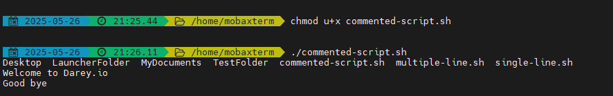

# Shell-scripting-comments

## Comments

A comment in shell scripting is a line or part of a line that is ignored by the computer when the script runs. It's written only for humans to read.

Comments are used to explain code, making it easier to understand and maintain. They are not executed by the shell.

They are used to document what the script does, why decisions were made, or how tricky parts work.

Comments are usually started with '#'

### Single-line Comments

The screenshot below illustrates single-line comments as used in a script.

When the script is executed, the line that started with '#' was not executed.

### Multiple Single-line Comments

To comment multiple lines, each line is started with '#' as illustrated below:

When the script is executed all the lines starting with '#' are ommited by the interpreter.

### Task

1. Using the vim command, I created a bash script named commented-script.sh

2. The content of the script include: 

    1. a shebang line,  
    2. a single-line comment  
    3. a mkdir command to create a folder 'TestFolder'  
    4. multiple single-line comment  
    5. ls command to list files  
    6. an echo command to display a welcome message which also has an inline comment  
    7. finally, another echo command to dsiplay a goodbye message, which also has an inline comment.

All these can be seen in the screeshot below:

3. I executed the commented-script.sh to performed the expected functions of  
    1. creating 'TestFolder' directory,  
    2. listing files  
    3. and displaying a welcome and goodbye message while ignoring the comments.

    See the screenshot below:

    

This project clearly illustrated how the use of comments can help system administrators and developers to effectively document their code.